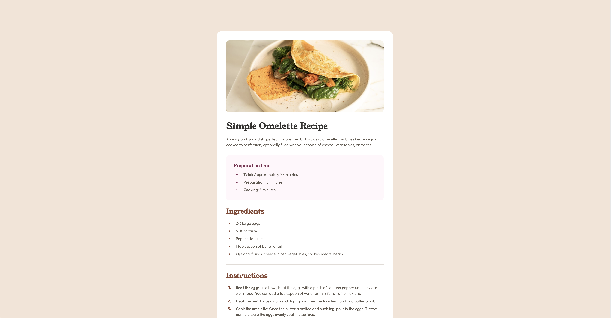

# Frontend Mentor - Recipe Page Solution

## Table of contents

- [Overview](#overview)
  - [Screenshot](#screenshot)
  - [Links](#links)
- [My process](#my-process)
  - [Built with](#built-with)
  - [What I learned](#what-i-learned)
  - [Continued development](#continued-development)

## Overview

### Screenshot



### Links

- [Solution:](https://github.com/kelseyjhayes/Recipe-Page)
- [Live Site:](https://kelseyjhayes.github.io/Recipe-Page/)

## My process

### Built with

- Semantic HTML5 markup
- CSS custom properties
- Flexbox
- Mobile-first workflow

### What I learned

This project was really enjoyable because I felt confident doing most things, but it was still challenging in areas I feel less confident in. For example, it was good practising how to style tables with inconsistent borders and padding across columns and rows.  

The biggest challenge in this project was trying to acheive the correct spacing between the number markers and text in the instructions list, as the CSS I used to create space between the marker and text for the previous lists caused the text to overlap its parent container's margin. After a lot of trial and error trying to make it work using the default list style markers, I eventually replaced the markers with pseudo-elements placed ::before the text, which gave me greater control of the spacing while ensuring the text stayed within its parent container. 

```css
ol {
  list-style:none;
  counter-reset:step;
  padding-inline-start:0;
}

ol li {
  counter-increment:step;
  position:relative;
  padding-inline-start: 2.5rem;
  margin-bottom:0.5rem;
}

ol li:last-of-type {
  margin-bottom:0;
}

ol li::before {
  content: counter(step) ".";
  position:absolute;
  left:0.25rem;
  font-weight:bold;
  color:var(--brown);
  width:1rem;
  text-align:right;
}
```

### Continued development

I'd like to get a better understanding of how fonts render different across browsers. I've found my design looks as it should in Chrome, but font weights are thicker in Safari which I feel impacts readability in certain areas. 